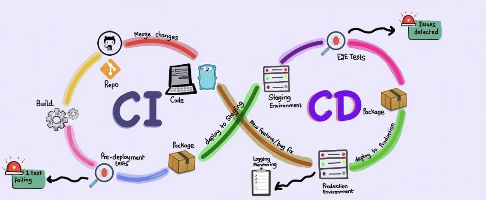
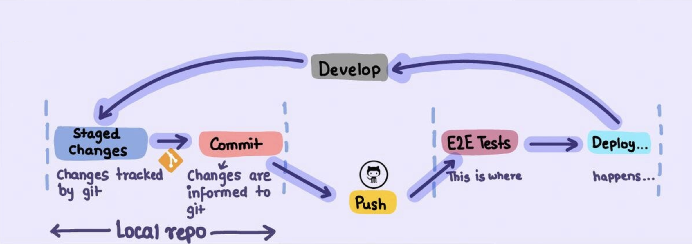
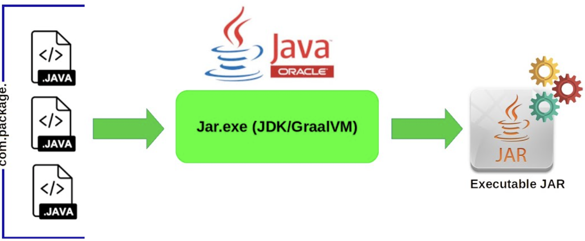
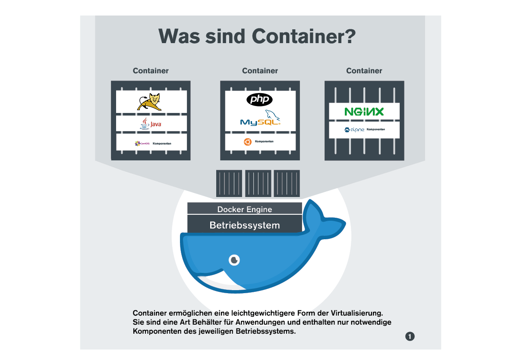
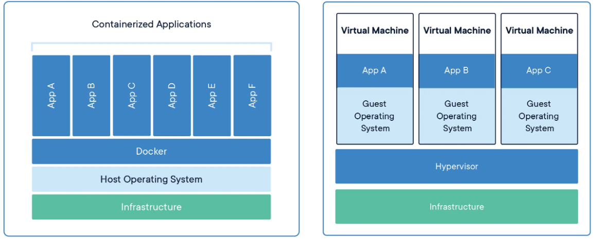
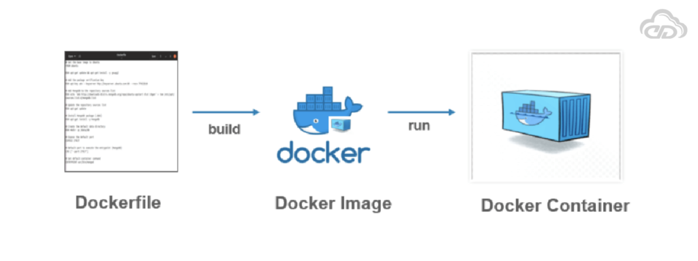
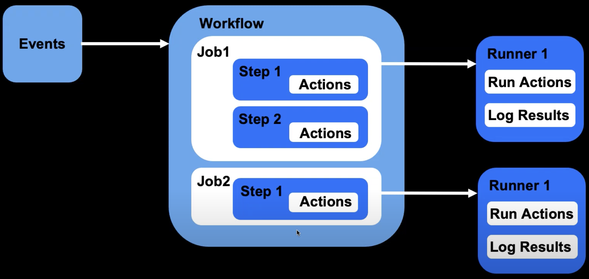
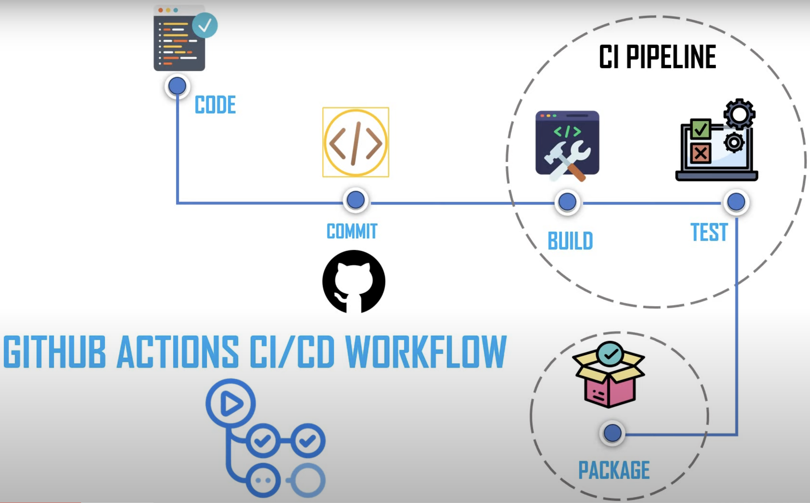

https://moteer.github.io/cicd/

### Agenda für diese Woche
- **CI / CD**
  - Intro
  - Containerisation mit Docker I & II
  - CI mit GitHub Actions
- **Spring Batch**
  - Intro
  - Example App
- **Projekt Batch in Banking**

---

### Modus für heute
- CI/CD Intro & Docker I
- Übungsstart & praktische Demo gleichzeitig
  - wer mag, darf schon in den BR abtauchen (siehe Lars letzte Woche)
- Lösungen
- evtl. Docker II am Nachmittag
- Übung & praktische Demo gleichzeitig
- 15:30 Feedback   

---

**Ziel für heute**
  - Ich kann CI/CD Grundlegend einordnen.
  - Mir ist bewusst, welche Probleme Docker löst & kenne die Begrifflichkeiten im Dockerumfeld (Dockerfile, Image, Container, etc) sowie kann sie auseinander halten.
  - Installation von Docker auf meinem Rechner.
  - Docker Container erfolgreich gestartet.
  - Ich habe Grundlegende Docker Befehle auf der Kommandozeile ausgeführt und verstanden
  - (Ich habe mein erstes Dockerfile geschrieben und einen eigenes Image erzeugt und dieses als Container gestartet)
---

### CI CD Übersicht
**Continuous Integration / Continuous Deployment (Delivery)**


---

### Entwickler Perspektive 
**Software Development Lifecycle**

>- Pull Requests?
>- Wann werden hier Tests ausgeführt?
---

### Artefact
- *Was ist ein auslieferbares Ergebnis eines Java Programms?*



---

>Maven
>```console
>./mvnw clean package
>java -cp target/Example-0.0.1-SNAPSHOT.jar
>```

>Gradle
>```console
>./gradlew build
>java -cp build/libs/Example-0.0.1-SNAPSHOT.jar
>```

- *Welche Abhängigkeiten müssen alle erfüllt sein, um das JAR auf einem anderen Rechner (Testsytem, Produktionssystem, etc.) ausführen zu können?* ***-> Problem*** 

---

### Docker eine Lösung


Note:
- **Welche Probleme löst Docker** 
  - Portabilität der Anwendung mit all seinen Abhängikeiten JDK, Laufzeitumgebungen, Datenbanken, etc. 
  - Konsistente Umgebungen:
  - Docker stellt sicher, dass Entwicklung, Test und Produktion in derselben Umgebung erfolgen, um das "Es funktioniert auf meinem Computer"-Problem zu vermeiden.
  - Schnelle Bereitstellung:
    - Docker-Container können in Sekunden gestartet werden, was schnelle Tests, Bereitstellungen und Skalierungen ermöglicht.
  - Effiziente Ressourcennutzung:
    - Docker ermöglicht eine effiziente Ressourcennutzung durch die gemeinsame Nutzung des Host-Betriebssystems.
  - Einfache Skalierbarkeit & Orchestrierung:
    - Durch die einfache Skalierbarkeit von Docker-Containern können Java-Anwendungen problemlos auf mehreren Hosts ausgeführt werden.
  - Isolation und Abstraktion
  - Infrastruktur als Code (Dockerfile, docker-compose.yaml, ...)
  - Integration in CI/CD Pipelines
---

### Docker vs VM


Note: 
- **Docker:**
  - Teilt den Kernel des Host-Betriebssystems.
  - Schnelleres Starten und geringerer Ressourcenverbrauch.
  - Geringere Isolation.
- **Virtuelle Maschine:**
  - Enthält einen eigenen Betriebssystem-Kernel.
  - Langsameres Starten und höherer Ressourcenverbrauch.
  - Stärkere Isolation.

---

### Docker Elemente


- in einer lokalen Registry werden die Images gespeichert
- ein Docker Container kann auf Grundlage eines Images durch die Docker Engine ausgeführt werden

Note: 
  - Unterschied Docker Image - Container -> OOP Klasse - Instanz/Objekt
---

### DockerHub

**https://hub.docker.com/**

>Startet ein public Image als Container von Docker Hub
>```docker
>docker run docker/whalesay cowsay Hello!
>```
Note: 
- Es gibt Images zum direkt Verwenden auf DockerHub
- Diese kann man direkt starten oder als Image herunter laden
- Man kann ein eigenes Image mit einem Dockerfile erstellen 

---

**[Übungen](https://github.com/moteer/cicd/blob/main/exercises/exercise1.md)**

- Docker Referenz: https://docs.docker.com/engine/reference/commandline/run/
- https://www.youtube.com/watch?v=xGn7cFR3ARU

---

### Docker Kommandos
https://docs.docker.com/engine/reference/commandline/run/

```console
docker ps
docker ps -a
docker images
docker start ...
docker stop ...
docker rm ...
docker rmi ...
docker pull ...
docker exec ...
docker --help
```

---

### Dockerfile Beispiel

Referenz: https://docs.docker.com/engine/reference/builder/

>Dockerfile
>```docker
># Verwende das offizielle OpenJDK-Image als Basis
>FROM openjdk
>
># Setze das Arbeitsverzeichnis im Container
>WORKDIR /app
>
># Kopiere die JAR-Datei der Spring Boot-Anwendung ins Arbeitsverzeichnis
>COPY target/MyCompanyApp-0.0.1-SNAPSHOT.jar /app/
>
># Setze den Befehl, der beim Start des Containers ausgeführt wird
>CMD ["java", "-jar", "MyCompanyApp-0.0.1-SNAPSHOT.jar"]
>```

Note:
- Hiermit kann man auf Grundlage seines seiner eigene Anwendug ein Image erstellen

---

### Docker Image von Dockerfile bauen

- Stelle hier immer sicher, dass das JAR vorher gebaut wurde.
>```console
>docker build -t helloworld:2.0 .
>docker run helloworld:2.0
>```

Note:
- hier Beispiel Helloworld App ohne spring-boot verwenden

---

**Ziel für Tag 2**
  - Ich habe mein erstes Dockerfile geschrieben und einen eigenes Image erzeugt und dieses als Container gestartet
  - Ich habe docker-compose für die Erstellung mehrerer Container eingesetzt und verstanden was da passiert
  - Ich habe verstanden, was eine CI Pipeline ist und eine erste mit GitHub Actions geschrieben

---

### Docker compose / mehrere Container 

docker-compose.yaml

>```json
>version: '3.8'
>
>services:
>  # MySQL-Datenbank-Service
>  db:
>    image: mysql:latest
>    environment:
>      MYSQL_ROOT_PASSWORD: rootpassword
>      MYSQL_DATABASE: mydatabase
>      MYSQL_USER: dbuser
>      MYSQL_PASSWORD: dbpassword
>   ports:
>      - "3307:3306"
>
>  # Webserver-Service mit Nginx
>  webserver:
>    image: nginx:latest
>    ports:
>      - "8081:80"
>```

Note:
- prüfen, ob sich die container finden können:

> Diese Befehle installieren einen mysql client
>```console
>apt-get update
>apt-get install -y default-mysql-client
>mysql -h db -u dbuser -p
>```

---

### Docker compose / eigene Anwendung

>```console
>version: '3.8'
>
>services:
>  # ...
>
>  # Deine eigene Anwendung
>  myapp:
>    build:
>      context: ./path/to/your/app
>```

---

### GitHub Actions

**Tools, Tools und noch mehr Tools**-> [Ecosystem](https://sapphireventures.com/wp-content/uploads/2022/12/FINAL_DEC2022_The-DevOps-Ecosystem-EUR-5.png)


---

### GitHub Actions

>Learn Github Actions:
>https://docs.github.com/en/actions/learn-github-actions/




---

### GitHub actions File

```yaml
name: Java HelloWorld

on:
  push:
    branches:
      - main

jobs:
  build:
    runs-on: ubuntu-latest

    steps:
      - name: Checkout Repository
        uses: actions/checkout@v2

      - name: Set up JDK
        uses: actions/setup-java@v2
        with:
          distribution: 'adopt'
          java-version: '11'

      - name: Compile and Run HelloWorld
        run: |
          mkdir bin
          javac -d bin src/main/java/org/example/Main.java
```
---

### GitHub Actions

**[Übungen](https://github.com/moteer/cicd/blob/main/exercises/exercise3.md)**

>https://docs.github.com/en/actions/learn-github-actions/

---

### GitHub Actions Beispiel



