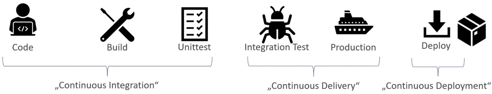
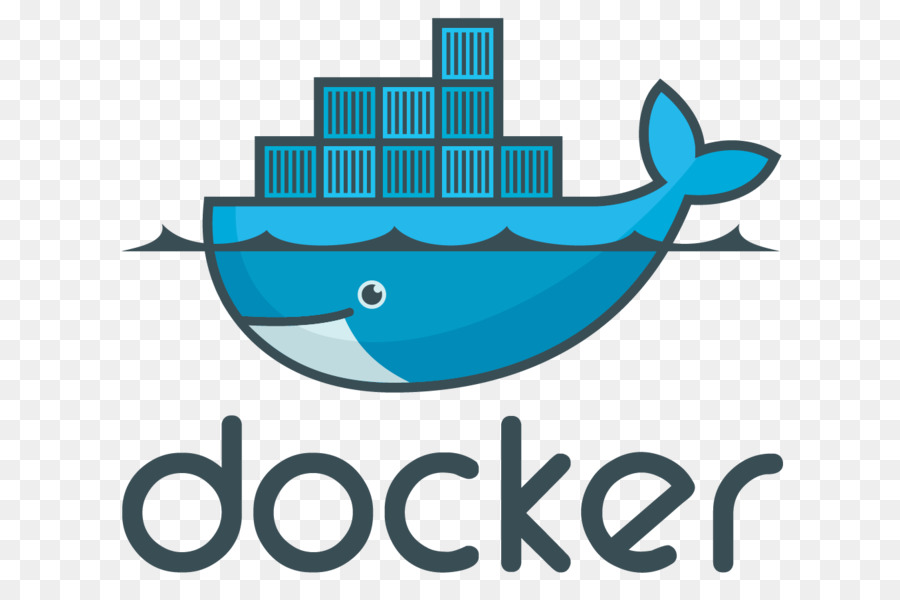
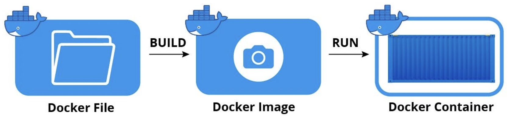

## Agenda für die Woche
- CI / CD
  - Docker
  - GitHub Actions
- Spring Batch
  - Zinsberechnung Account DB -> Account DB
  - Bankstatement Berechnung -> Account DB -> Statement DB
  - Überweisung CSV -> Accounts DB
  - Transaction management
  - Chunk based processing
  - Declarative I/O
  - Start/Stop/Restart
  - Retry/Skip
  - Web based administration interface (Spring Cloud Data Flow)


---

## CI/CD 
*Continuous Integration / Deployment-Delivery*



---

## JAR erstellen


```console
foo@bar:~$ ./mvnw clean package
foo@bar:~$ java -jar target/Example-0.0.1-SNAPSHOT.jar
```

---

## Docker


---
## Docker Elemente


Note: 
- Docker ist eine leistungsstarke Plattform für die Containerisierung von Anwendungen.
- Container ermöglichen die Kapselung von Anwendungen und ihrer Abhängigkeiten in isolierten Umgebungen.
- Im Gegensatz zu virtuellen Maschinen teilen Container das Betriebssystem des Hosts und sind dadurch leichtgewichtiger und schneller.

---

## Dockerfile
- Dockerfile beispiel zeigen und erklären Referenz: https://docs.docker.com/engine/reference/builder/

```docker
# Verwende das offizielle OpenJDK-Image als Basis
FROM openjdk

# Setze das Arbeitsverzeichnis im Container
WORKDIR /app

# Kopiere die JAR-Datei der Spring Boot-Anwendung ins Arbeitsverzeichnis
COPY target/MyCompanyApp-0.0.1-SNAPSHOT.jar /app/

# Setze den Befehl, der beim Start des Containers ausgeführt wird
CMD ["java", "-jar", "MyCompanyApp-0.0.1-SNAPSHOT.jar"]
```
---

# Slide 2: Motivation für Docker in CI/CD für Java
## Warum Docker in CI/CD für Java?

- **Konsistente Umgebungen:**
  - Docker stellt sicher, dass Entwicklung, Test und Produktion in derselben Umgebung erfolgen, um das "Es funktioniert auf meinem Computer"-Problem zu vermeiden.

- **Schnelle Bereitstellung:**
  - Docker-Container können in Sekunden gestartet werden, was schnelle Tests, Bereitstellungen und Skalierungen ermöglicht.

- **Effiziente Ressourcennutzung:**
  - Docker ermöglicht eine effiziente Ressourcennutzung durch die gemeinsame Nutzung des Host-Betriebssystems.

- **Einfache Skalierbarkeit:**
  - Durch die einfache Skalierbarkeit von Docker-Containern können Java-Anwendungen problemlos auf mehreren Hosts ausgeführt werden.

---

# Slide 3: Docker vs. Virtuelle Maschine (VM)
## Der Unterschied zwischen Docker und einer VM


- **Docker:**
  - Teilt den Kernel des Host-Betriebssystems.
  - Schnelleres Starten und geringerer Ressourcenverbrauch.
  - Geringere Isolation.

- **Virtuelle Maschine:**
  - Enthält einen eigenen Betriebssystem-Kernel.
  - Langsameres Starten und höherer Ressourcenverbrauch.
  - Stärkere Isolation.